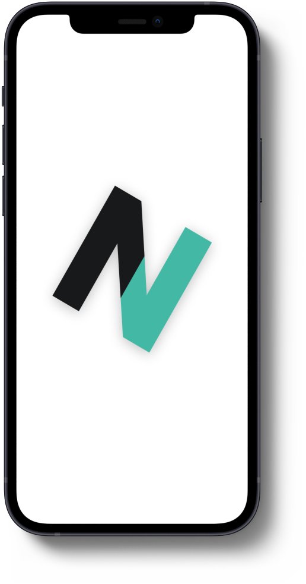
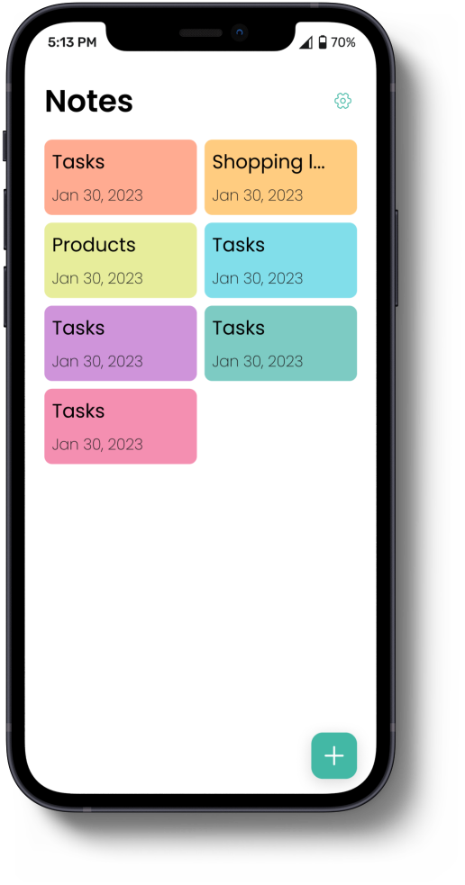
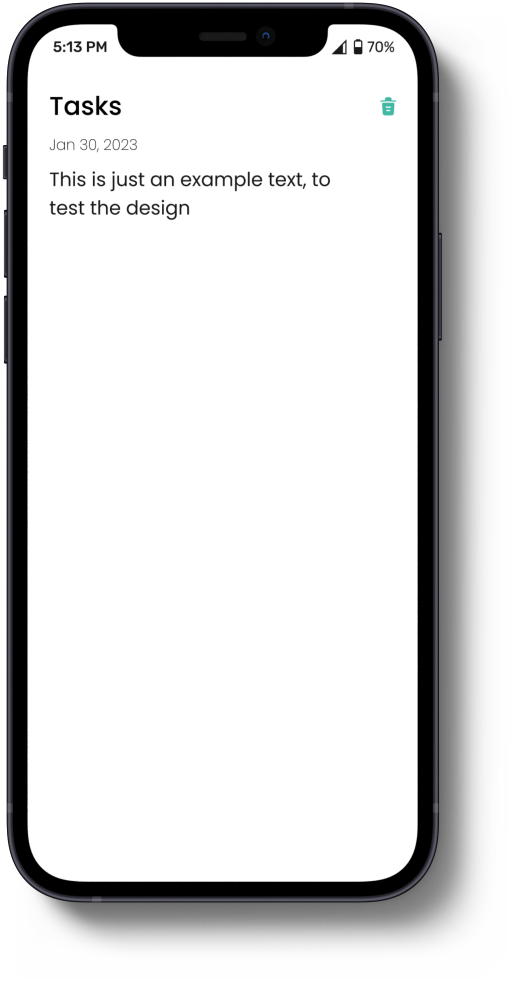
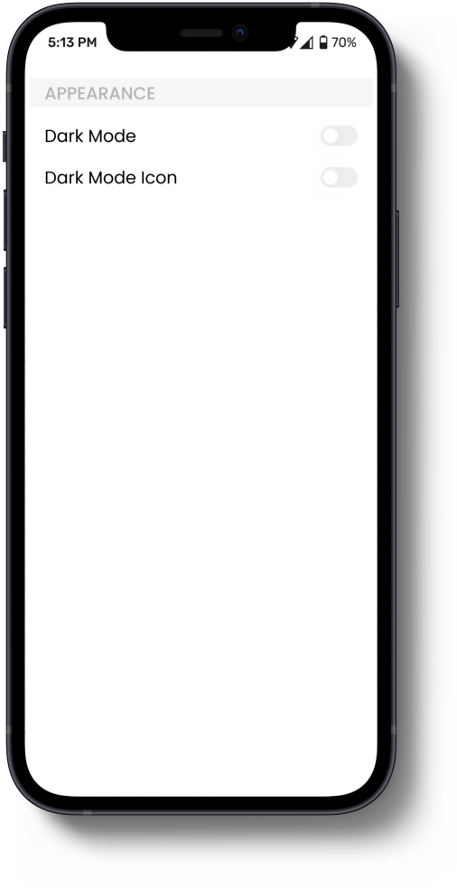
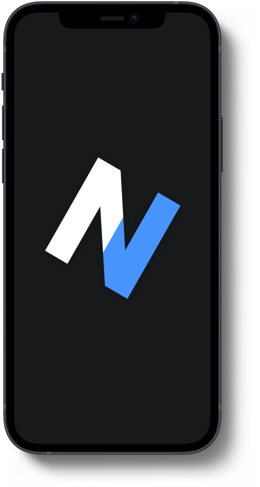
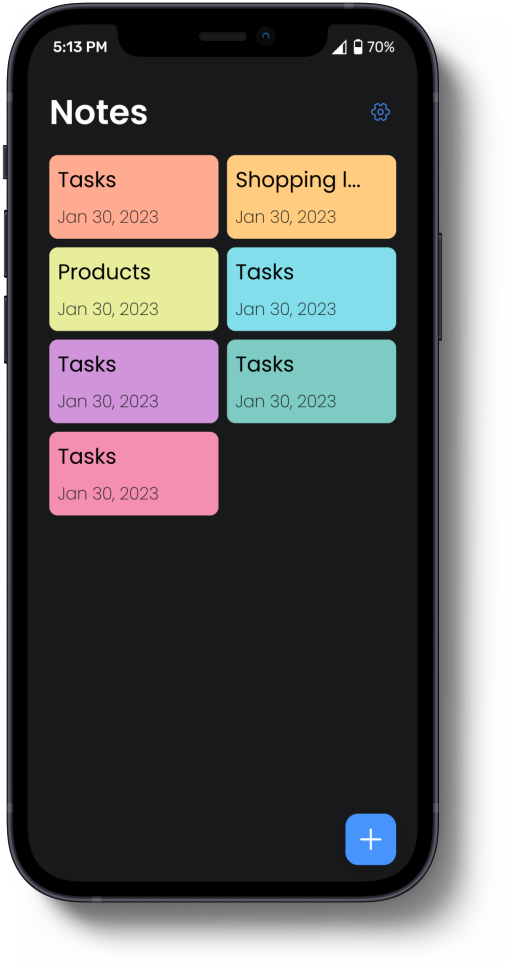
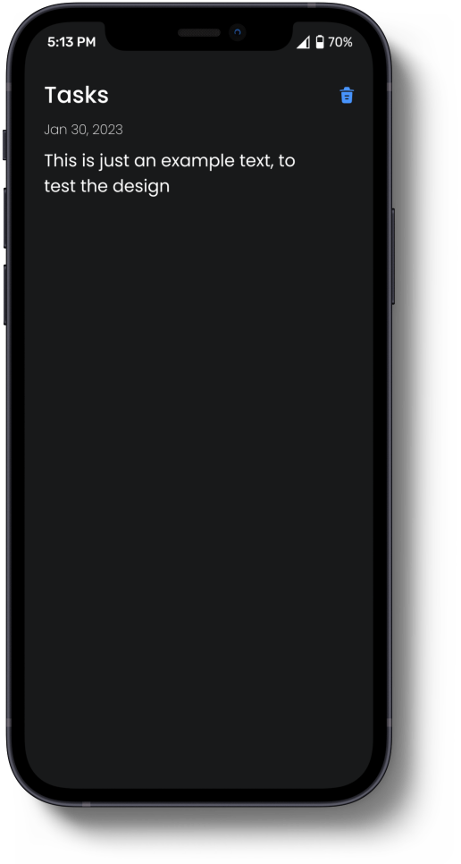
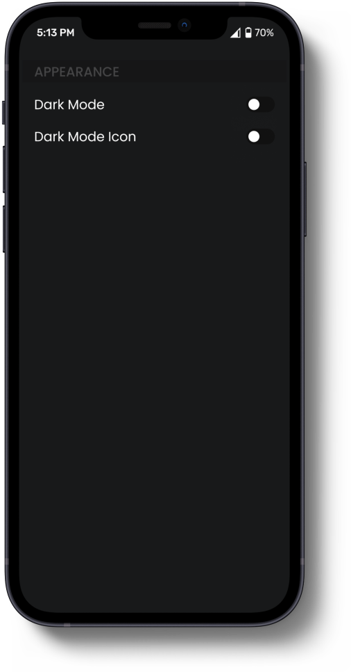

# Notey

---

> Basic note application created by [**ABDO-AR**](https://github.com/ABDO-AR), using the Flutter framework based on the MVC archticutre.

###### My Portfolio [Here](https://).

## Setup

---

Run the following commands from your terminal:

1) `git clone https://github.com/ABDO-AR/notey_flutter.git` to clone this repository

2) `flutter pub get` in the project root directory to install all the required dependencies.

## Preview Download Links

---

1. [Android - APK](https://)

## Screenshots & Preview Video

---

<table width="100%">
  <tbody>
    <tr>
      <td width="1%"></td>
      <td width="1%"></td>
      <td width="1%"></td>
    </tr>
    <tr>
      <td width="1%"></td>
      <td width="1%"></td>
      <td width="1%"></td>
    </tr>
    <tr>
      <td width="1%"></td>
      <td width="1%"></td>
    </tr>
  </tbody>
</table>

## LICENSE

---

Notey is [Apache License 2.0](https://github.com/ABDO-AR/notey_flutter/blob/main/LICENSE).