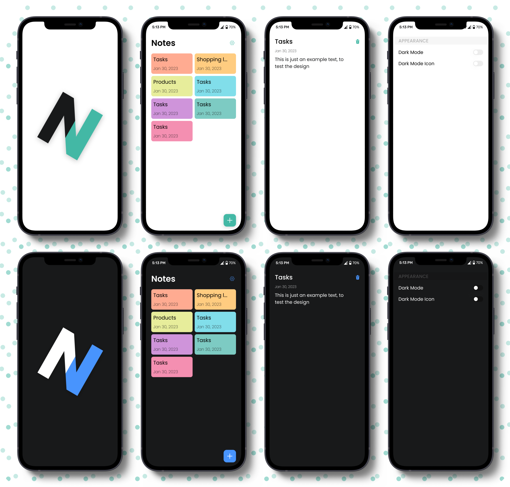
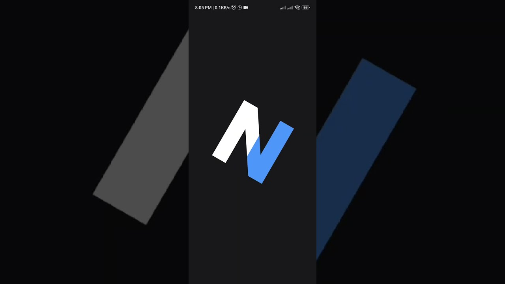

# Notey

---

> Basic note application created by [**ABDO-AR**](https://github.com/ABDO-AR), using the Flutter framework based on the
> MVC architecture.

###### My Portfolio [Here](https://).

## Setup

---

Run the following commands from your terminal:

1) `git clone https://github.com/ABDO-AR/notey_flutter.git` to clone this repository

2) `flutter pub get` in the project root directory to install all the required dependencies.

## Preview Download Links

---

1. [Android - APK](https://drive.google.com/file/d/1-4w-mBcYWkE7JTwWaaPuLQKZXh8G7_gt/view?usp=drive_link)

## Screenshots & Quick Video

---

Quick Video

Screenshots

<table width="100%">
  <tbody>
    <tr>
      <td width="1%"></td>
      <td width="1%"></td>
      <td width="1%"></td>
    </tr>
    <tr>
      <td width="1%"></td>
      <td width="1%"></td>
      <td width="1%"></td>
    </tr>
    <tr>
      <td width="1%"></td>
      <td width="1%"></td>
    </tr>
  </tbody>
</table>

## Features

---

- CRUD Operations in notes.
- Dark & Light theme.
- Dark & Light application icon can be changed at the runtime by the user.

## Used Packages

---

- [Get](https://pub.dev/packages/get)
- [Get Storage](https://pub.dev/packages/get_storage) 
- [Hive](https://pub.dev/packages/hive) 
- [Hive Flutter](https://pub.dev/packages/hive_flutter) 
- [Google Fonts](https://pub.dev/packages/google_fonts) 
- [Equatable](https://pub.dev/packages/equatable) 
- [Flutter Switch](https://pub.dev/packages/flutter_switch) 
- [Flutter Dialogs](https://pub.dev/packages/flutter_dialogs) 
- [Flutter SVG](https://pub.dev/packages/flutter_svg) 

## LICENSE

---

Notey is [Apache License 2.0](https://github.com/ABDO-AR/notey_flutter/blob/main/LICENSE).